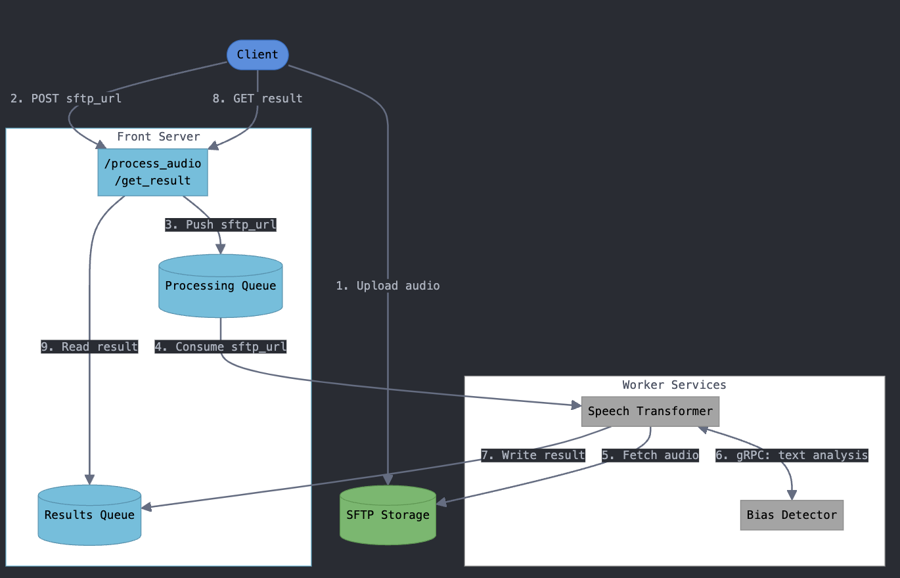

#BIAS
#Bias Detection System

A microservice-based system that analyzes presidential speeches for bias by processing audio files and generating bias scores.

## Overview

This service provides RESTful endpoints allowing users to submit audio recordings of presidential speeches and receive quantitative bias assessments. The system processes the audio through speech-to-text conversion and performs bias analysis using state-of-the-art natural language processing models.

## Architecture



The system consists of three main components:

### 1. Front Server

Provides two REST endpoints:
- `POST /process_audio`: Accepts an SFTP address pointing to an audio file
- `POST /get_result`: Accepts a file URI and returns the computed bias score if analysis is complete

### 2. Worker Services

#### Speech Transformer
- Converts audio files to text using Python's speech recognition library
- Handles multiple audio formats
- Optimized for speech processing

#### Bias Detector
- Utilizes the `distilbert-base-uncased-finetuned-sst-2-english` model
- Specialized in detecting bias in political speeches
- Produces a normalized bias score

### 3. Monitoring Stack
- Prometheus for metrics collection and monitoring
- Grafana dashboards for visualization and alerting
- Real-time performance tracking and system health monitoring

## Prerequisites

- Docker and Docker Compose
- Kubernetes cluster (for deployment)
- SFTP server for file storage
- Access to container registry

## Installation & Deployment

1. Configure SFTP Server
```bash
# Configuration steps will depend on your SFTP server choice
# Sample test data is provided in the test-data directory
```

2. Build and Push Docker Images
```bash
# Build images
docker build -t transformer:latest -f transformer/Dockerfile .
docker build -t bias-detector:latest -f bias-detector/Dockerfile .
docker build -t front-server:latest -f front-server/Dockerfile .

# Push to your container registry
docker push /transformer:latest
docker push /bias-detector:latest
docker push /front-server:latest
```

3. Deploy Services
```bash
# Apply Kubernetes deployments
kubectl apply -f deployment/
```

4. Setup Monitoring (Optional)
```bash
# Apply Prometheus configuration
kubectl apply -f conf/prometheus/

# Deploy Grafana
kubectl apply -f conf/grafana/
```

## Directory Structure

```
.
├── deployment/          # Kubernetes deployment files
├── conf/               # Configuration files
│   ├── prometheus/     # Prometheus configuration
│   └── grafana/        # Grafana dashboards
├── src/                # Source code
│   ├── transformer/    # Speech-to-text service
│   ├── bias-detector/  # Bias analysis service
│   └── front-server/   # API gateway
└── test-data/         # Sample audio files for testing
```

## Monitoring

The system provides comprehensive monitoring through:
- Resource usage metrics (CPU, memory, network)
- Processing pipeline metrics (conversion time, analysis time)
- Error rates and system health indicators
- Custom Grafana dashboards for visualization